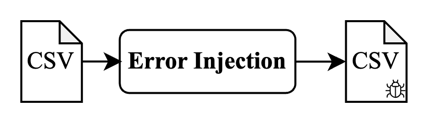
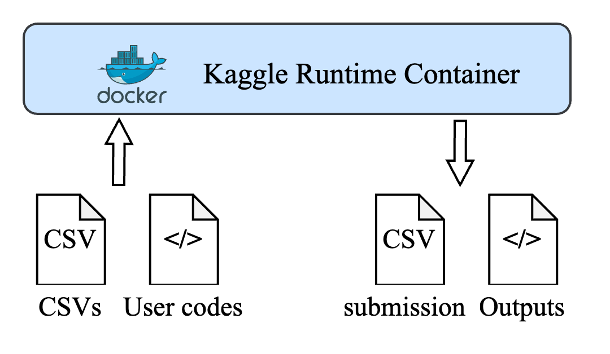
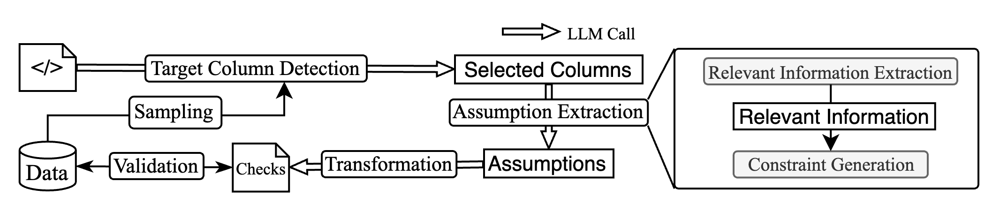

[](https://codecov.io/gh/guangchen811/cadv-exploration)

# Context-aware Data Validation

## Overview

This repository is designed for exploring the data validation ability of llms with context information (e.g., downstream
queries, downstream ml pipelines, etc.).

This repository contains the following components:

- [error_injection](./cadv_exploration/error_injection): contains the APIs for injecting errors into datasets.
- [runtime_environments](./cadv_exploration/runtime_environments): contains the API class for runtime environments,
  where datasets can be evaluated on downstream queries or machine learning pipelines.
- [inspector](./cadv_exploration/inspector): designed to provide dataset information, such as schema and statistics, to
  help LLMs generate data validation rules.
- [llms](./cadv_exploration/llm): contains the prompts and classes for making API calls to LLMs.

## error injection



The error injection module is built based on [Jenga](https://github.com/schelterlabs/jenga), a library for injecting
errors into datasets. We plan to extend the error injection methods into more real world scenarios where we often need
context information to fix the errors.

The errors are shown in the following table:

| **Type**                      | **Explanation**                                                                    |
|-------------------------------|------------------------------------------------------------------------------------|
| Data formatting               | Change the format of data in the original dataset (e.g., DD/MM/YYYY vs MM/DD/YYYY) |
| Missing categorical value     | Delete some values when recognizing a categorical column.                          |
| Violated attribute dependency | Change the value of one column based on the value of another column.               |

## runtime environments

We use Kaggle as the first runtime environment to evaluate the generated data validation rules. The Kaggle runtime
environment is downloaded from their [official GitHub repository](https://github.com/Kaggle/docker-python). The figure
shows that we run the user ipynb codes on the Kaggle dataset with the Kaggle runtime environment. The output
contains two parts: a new notebook with the outputs and the submission CSV file. For more details, you can look
at [this test case](./tests/runtime/kaggle/test_runnable.py).



## inspector

The inspector module is designed to provide dataset information, such as schema and statistics. It is built based
on [pydeequ](https://github.com/awslabs/python-deequ) and [pandas](https://pandas.pydata.org/).

## llms

Currently, we use [langchain](https://www.langchain.com/) as the tool for llm api calls. We plan to extend it
to [dspy](https://dspy-docs.vercel.app/) in the future.

As shown in the following figure, we decompose the data validation task into two three sub-tasks:

- Target column detection: detect the target column that needs to be validated based on the downstream queries or
  machine learning pipelines.
- Assumption generation: generate assumptions based on the target column and the context information.
- Rule generation: generate formal rules in the form
  of [deequ](https://github.com/awslabs/python-deequ/blob/master/pydeequ/checks.py) for evaluation.



The prompts during the API calls can be found [here](./cadv_exploration/llm/langchain/_prompt.py). For more details, you
can look at the [test case](./tests/llm/langchain).

## Get Started

### Install the package

```shell
poetry install
```

### Run the tests

```shell
poetry run pytest
```

### Collect the competition data

```shell
shell ./cadv_exploration/scripts/shell/download_competition_dataset.sh
```

### Kaggle File Structure

To make the code from kaggle work on the local machine, this project binds the local directory to the kaggle directory
in the following way:

```python
f"{local_project_path / 'files'}:/kaggle/input/{dataset_name}/",
f"{script_path.parent}:/kaggle/script/",
f"{output_path}:/kaggle/output/",
```

These bindings require the kaggle code meets the following requirements:

1. They should read the input data from `/kaggle/input/{dataset_name}/` instead of `/kaggle/input/`.
2. The submission file should be written to `/kaggle/output/` instead of `/kaggle/output/` instead of the working
   directory.

A typical local dataset structure should be like this:

```
.
└── healthcare-dataset
    ├── files
    │    ├── healthcare_dataset.csv
    ├── broken_files    
    │    ├── orignal_train
    │    │      ├── healthcare_dataset.csv
    │    ├── original_validation
    │    │      ├── healthcare_dataset.csv
    │    ├── pre_corruption
    │    │      ├── healthcare_dataset.csv
    │    ├── post_corruption
    │    │      ├── healthcare_dataset.csv
    ├── kernels_ipynb
    │    ├── graduation-project-m1e.ipynb
    │    ├── healthcare-data-science-repo.ipynb
    ├── kernels_py
    │    ├── graduation-project-m1e.py
    │    ├── healthcare-data-science-repo.py
    └── output
        ├── graduation-project-m1e
        │    ├── graduation-project-m1e.ipynb
        │    ├── <submission_file if competition>
        │    ├── validation_result
        │    │    ├── langchain.json
        │    │    ├── deequ.json   
        ├── healthcare-data-science-repo
        │    ├── healthcare-data-science-repo.ipynb
        │    ├── <submission_file if competition>
        │    ├── validation_result
        │    │    ├── langchain.json
        │    │    ├── deequ.json
```

### TODO


1. change working directory in kaggle docker image to the notebook directory.
2. unused columns as an example.
3. fix deequ functions.

# Other Thoughts

If we can use provenance techniques to build a dataset that labels which columns are used by which queries or codes. We
can use it to train a model that can predict which columns are likely to be used by a new query or code.

How to leverage SchemaPile to train a model to predict which columns are likely to be used to add checks? checks can be
treated as a node-level classification problem. We can use the schema information to build a graph where each node is a
column and each edge is (a foreign key relationship or other relationships). We can use the graph to train a model that
can predict which columns are likely to be used by a new query or code.

Which relations can be used to connect columns into a graph? may be some function dependencies, correlations, semantic
relationships. What are the node features? column name, data type, and other metadata. What are the edge features?
foreign key relationships, other relationships.

Raha paper gives me some references about how to classify errors in data. It is a good start point. I can extend it when
context is given to make the task more formal.

I should also see how context can be helpful for the error type that already mentioned in raha.

Maybe I need to design a new component for llm to write queries on the table to check some information.

Data Provenance method can be used to find which columns are used by a script.


auto EDA