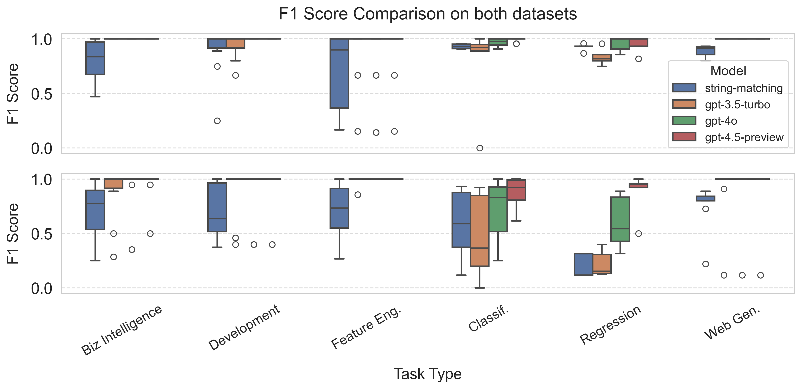

# Column Access Detection

This experiment is designed to detect the columns that are accessed in a given script. You could find the code we used
to perform the experiments in the [run_pipeline.py](./run_pipeline.py) file. The source code of the string-matching
baseline is [string_matching.py](./string_matching.py). After collecting the results in tabular format and storing them
in the [tables](./tables) directory, we use [virtualization.py](./virtualization.py) to visualize the results. The
results are stored in the [figs](./figs) directory.

  

  <em>F1 scores for column access detection on various downstream tasks. Our system outperforms the baseline across all task types, often by a wide margin.</em>

